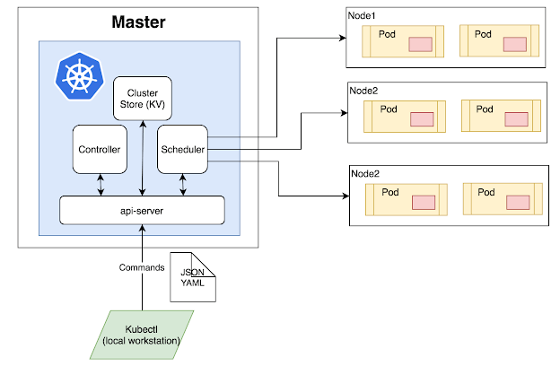

# Kubernetes Tutorial for Beginners: Basics, Features, Architecture

> <b>What is Kubernetes?</b>

- `Kubernetes` is a container management system developed on the Google platform.
- Kubernetes helps to manage containerized applications in various types of physical, virtual, and cloud environments.
- Google Kubernetes is a `highly` flexible container tool to consistently deliver complex applications running on `clusters` of hundreds to thousands of individual servers.

> <b>What task are performed by Kubernetes?</b>

- `Kubernetes` is the `Linux kernel` which is used for distributed systems. It helps you to be abstract the underlying hardware of the nodes(servers) and offers a consistent interface for applications that consume the shared pool of resources.

> `Note` : `Pool` of resources means CPU, memory, storage, and network bandwidth. `Nodes` are the servers that are used to run the `applications`.

> <b>Why use Kubernetes?</b>

- Kubernetes helps you to control the resource `allocation` and `traffic` management for cloud applications and `microservices`.
- It also helps to simplify various aspects of service-oriented infrastructures.
- Kubernetes allows you to assure where and when containerized applications run and helps you to find resources and tools you want to work with.
  
> <b>Features of Kubernetes</b>

Here are the essential Kubernetes features:

- `Automated Scheduling` : Kubernetes allows you to describe the resources you want to use and the number of containers you want to run. It helps you to schedule the containers across the cluster to meet the resource requirements and optimize hardware resources.
- `Self-Healing Capabilities` : Kubernetes helps you to replace and reschedule the containers from the failed nodes. It also kills and restarts the containers that do not respond to your user-defined health check.
- `Automated rollout & rollback` : Kubernetes allows you to roll out the changes across the system or in a specific part of the system. It also helps you to roll back to the previous configurations if the system is not stable.
- `Horizontal Scaling & Load Balancing` : Kubernetes allows you to scale the containerized applications and their resources on the fly. It also helps you to balance the load across the clusters.
- `Offers environment consistency for development, testing, and production` : Kubernetes allows you to provide the same environment for development, testing, and production. It also helps you to run the same code in the same environment.
- `Infrastructure is loosely coupled to each component can act as a separate unit` : Kubernetes allows you to update, replace, and delete the containers without affecting the rest of the system. It also helps you to add the containers for extra resources.
- `Provides a higher density of resource utilization` : Kubernetes allows you to run more workloads on the same hardware. It also helps you to utilize the resources more efficiently.
- `Offers enterprise-ready features` : Kubernetes offers enterprise-ready features such as authentication, authorization, logging, and monitoring. It also helps you to run the same code in the same environment.
- `Application-centric management` : Kubernetes allows you to define the resources and their requirements for the applications. It also helps you to deploy the applications and manage their policies, such as restart policies, upgrade policies, and fault tolerance.
- `Auto-scalable infrastructure`e : Kubernetes allows you to scale the infrastructure automatically based on the current resource utilization. It also helps you to scale the infrastructure manually based on the predicted resource utilization.
- `You can create predictable infrastructure` : Kubernetes allows you to create the infrastructure that is predictable, resilient, and manageable. It also helps you to create the infrastructure that is loosely coupled and highly available.

> <b>Kubernetes Basics</b>

- `Cluster`: It is a collection of hosts(servers) that helps you to aggregate their available resources. That includes ram, CPU, ram, disk, and their devices into a usable pool.

- `Master`: The master is a collection of components which make up the control panel of Kubernetes. These components are used for all cluster decisions. It includes both scheduling and responding to cluster events.

- `Node`: It is a single host which is capable of running on a physical or virtual machine. A node should run both kube-proxy, minikube, and kubelet which are considered as a part of the cluster.

- `Namespace`: It is a logical cluster or environment. It is a widely used method which is used for scoping access or dividing a cluster.

> <b>Kubernetes Architecture</b>

Below is a detailed `Kubernetes Architecture` diagram:

 </img>
 

<b>Kubernetes Architecture Diagram</b>

 

<b> Master Node</b> :

- The master node is the first and most vital component which is responsible for the management of Kubernetes cluster. It is the entry point for all kind of administrative tasks. There might be more than one master node in the cluster to check for fault tolerance.

- The master node has various components like `API Server`, `Controller Manager`, `Scheduler`, and `ETCD`. Let see all of them.

  - `API Server`: The API server acts as an entry point for all the REST commands used for controlling the cluster.
  - `Controller Manager`: The controller manager is responsible for the functioning of the controller. It is a daemon that embeds the core control loops which are shipped with Kubernetes.
  - `Scheduler`: The scheduler is responsible for the distribution of work or containers across multiple nodes. It is a daemon that is responsible for tracking the utilization of various nodes and then schedules the containers accordingly.
  - `ETCD`: It is a key-value store which is used for storing the cluster data. It is a simple, reliable, and distributed database which is written in Go language. It is used for storing the configuration data of the cluster which can be used by the components of the master node.

- `Worker/Slave nodes`
Worker nodes are another essential component which contains all the required services to `manage the networking` between the containers, communicate with the `master node`, which allows you to assign resources to the scheduled containers.

  - `Kubelet`: gets the configuration of a Pod from the API server and ensures that the described containers are up and running.
  - `Docker Container`: Docker container runs on each of the worker nodes, which runs the configured pods
  - `Kube-proxy`: Kube-proxy acts as a load balancer and network proxy to perform service on a single worker node
  - `Pods`: A pod is a combination of single or multiple containers that logically run together on nodes

> <b>Other Key Terminologies</b>
>
- `Replication Controllers` : A replication controller is an object which defines a pod template. It also controls parameters to scale identical replicas of Pod horizontally by increasing or decreasing the number of running copies.

- `Replication Sets` : Replication sets are an interaction on the replication controller design with flexibility in how the controller recognizes the pods it is meant to manage. It replaces replication controllers because of their higher replicate selection capability.

- `Deployments` : Deployment is a common workload which can be directly created and manage. Deployment use replication set as a building block which adds the feature of life cycle management.

- `Stateful Sets` : It is a specialized pod control which offers ordering and uniqueness. It is mainly used to have fine-grained control, which you have a particular need regarding deployment order, stable networking, and persistent data.

- `Daemon Sets` : Daemon sets are another specialized form of pod controller that runs a copy of a pod on every node in the cluster. This type of pod controller is an effective method for deploying pods that allows you to perform maintenance and offers services for the nodes themselves.

> <b>Kubernetes vs. Docker Swarm</b>

| Parameter                                             | Docker Swarm                                                      | Kubernetes                                                                                                                       |
| ----------------------------------------------------- | ----------------------------------------------------------------- | -------------------------------------------------------------------------------------------------------------------------------- |
| Scaling                                               | No Autoscaling                                                    | Auto-scaling                                                                                                                     |
| Load balancing                                        | Does auto load balancing                                          | Manually configure your load balancing settings                                                                                  |
| Storage volume sharing                                | Shares storage volumes with any other container                   | Shares storage volumes between multiple containers inside the same Pod                                                           |
| Use of logging and monitoring tool                   | Use 3rd party tool like ELK                                       | Provide an in-built tool for logging and monitoring.                                                                             |
| Installation                                          | Easy & fast                                                       | Complicated & time-consuming                                                                                                     |
| GUI                                                   | GUI not available                                                 | GUI is available                                                                                                                 |
| Scalability                                           | Scaling up is faster than K8S, but cluster strength not as robust | Scaling up is slow compared to Swarm, but guarantees stronger cluster state Load balancing requires manual service configuration |
| Load Balancing                                        | Provides a built-in load balancing technique                      | Process scheduling to maintain services while updating                                                                           |
| Updates & Rollbacks Data Volumes Logging & Monitoring | Progressive updates and service health monitoring.                | Only shared with containers in same Pod Inbuilt logging & monitoring tools.                                                      |

> `Kubeconfig` file is a YAML file that contains all the cluster information and credentials to connect to the cluster.

## References
- [Kubernetes Crash Course for Absolute Beginners](https://youtu.be/s_o8dwzRlu4)
- [Kubernetes Tutorial for Beginners: Basics, Features, Architecture](https://www.guru99.com/kubernetes-tutorial.html)
- [Kubernetes Deployment Tutorial For Beginners](https://devopscube.com/kubernetes-deployment-tutorial/)